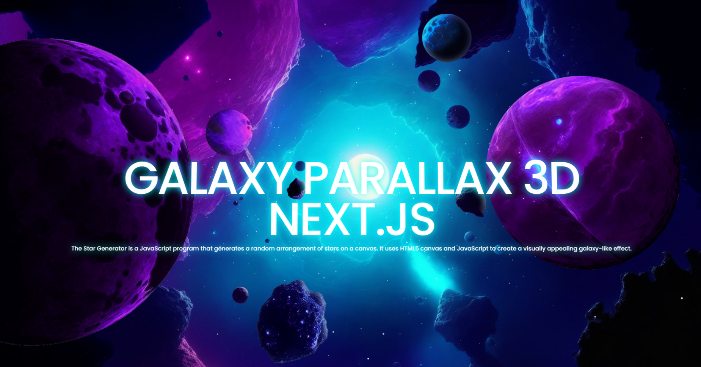

## Descripción

Galaxy Parallax 3D es una aplicación web que muestra un efecto de paralaje en 3D con imágenes de galaxias.

## Características

- Efecto de paralaje en 3D
- Imágenes de alta calidad de galaxias
- Interfaz de usuario intuitiva

## Capturas de pantalla

Aquí se muestran algunas capturas de pantalla de la aplicación:

## Instalación

1. Clona este repositorio.
2. Navega al directorio del proyecto: `cd galaxy-parallax-3d`
3. Instala las dependencias: `npm install`

## Uso

1. Inicia la aplicación: `npm start`
2. Abre tu navegador y visita `http://localhost:3000`
